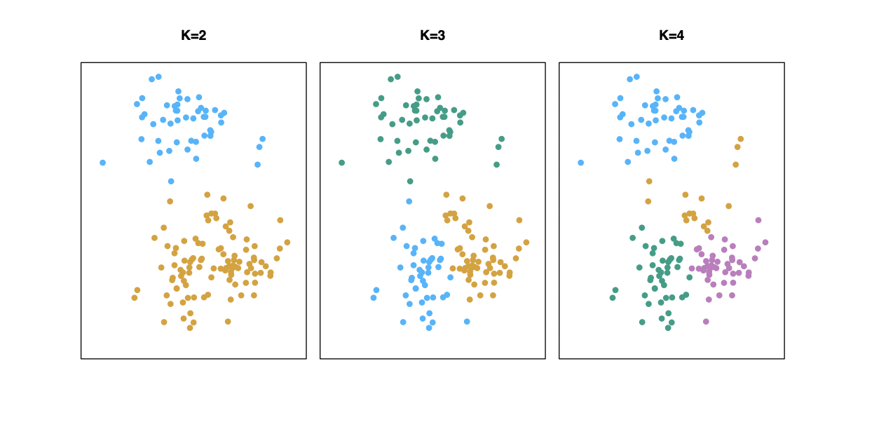

# K_Mean_Clustering_and_PCA
 This project showcase the application machine learning algorithms with K-Mean Clustering and Principal Component Analysis (PCA).

 To understand the full mathematical concepts behind this algorithm, go ahead and read Chapter 10 of [Introduction to Statistical Learning](http://faculty.marshall.usc.edu/gareth-james/ISL/).

**K Mean Clustering is an Unsupervised machine learning algorithm** that attempts to group similar clusters together in the dataset.

## Examples of Typical Clustering Problems
- Cluster of similar documents
- Cluster of customers based on faetures
- Market segmentation 
- Identification of similar physical groups

# K-Means Clustering
- To perform K-means clustering, one must first specify the desired number of clusters K
- Then the K-means algorithm will assign each observation to exactly one of the K clusters.

- The main objective is to have a minimal "within-cluster-variation": this implies that elements within a cluster should be as similar as possible.
- One way to achieve this is to minimize the sum of all the **pair-wise squared Euclidean distances** between the observations in each cluster.
- The initial step is to randomly assign each observation to one of K cluster.
- Iterate until the cluster assignments stop changing:
  - For each of the K clusters, compute the cluster centroid. The Kth cluster centroid if the mean of the observations assigned to the K^th cluster.
  - Assign each observation to the cluster whose centroid is closest (where "closest" is defined using Euclidean distance).

