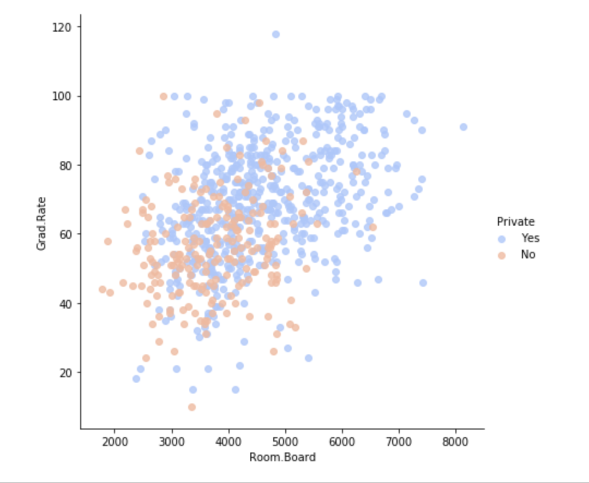
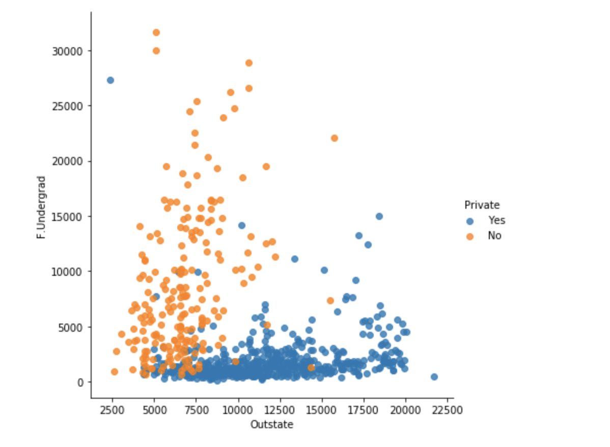
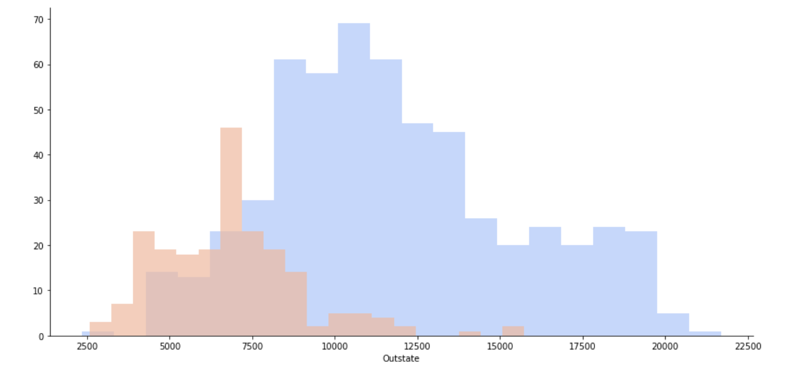
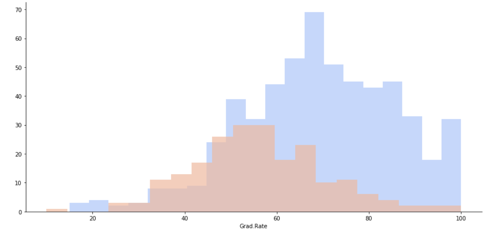
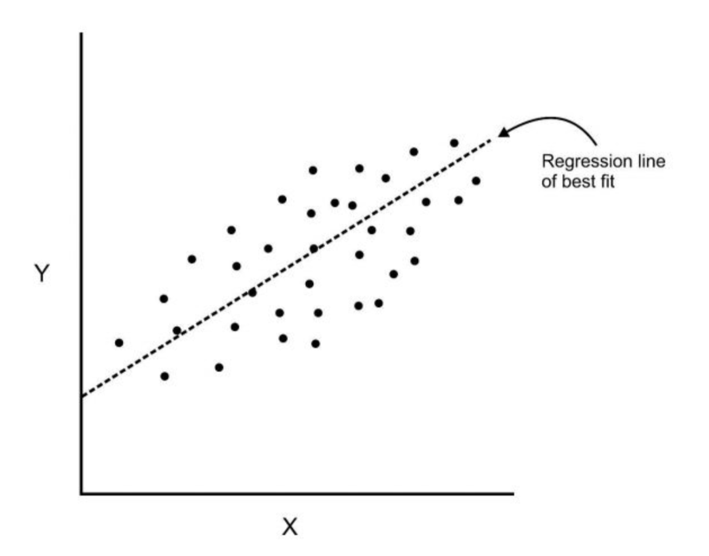
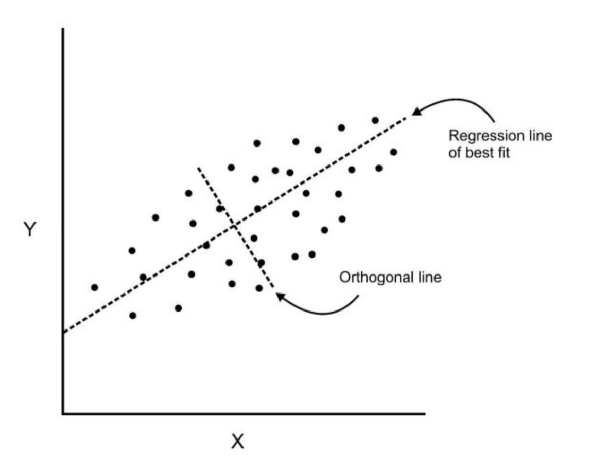
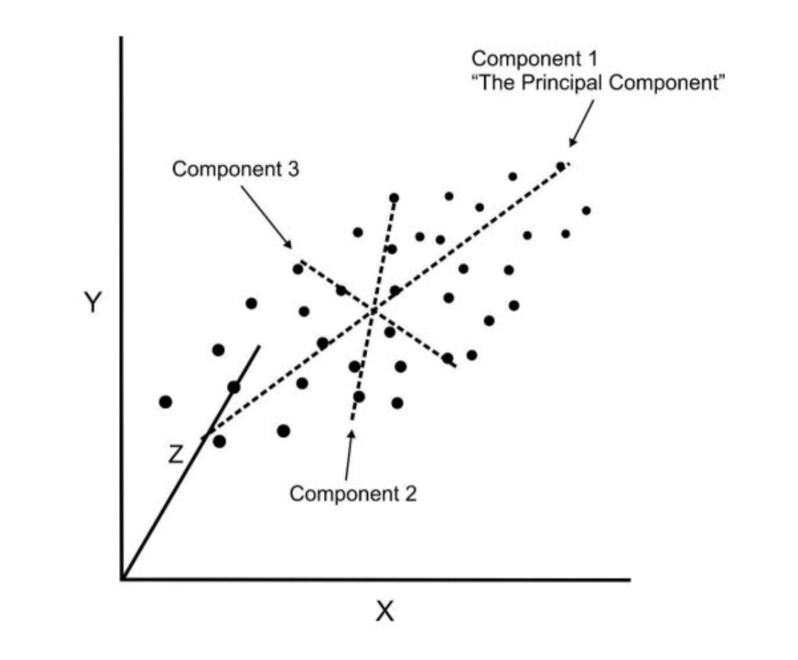

# K_Mean_Clustering_and_PCA
 This project showcase the application machine learning algorithms with K-Mean Clustering and Principal Component Analysis (PCA).

 To understand the full mathematical concepts behind this algorithm, go ahead and read Chapter 10 of [Introduction to Statistical Learning](http://faculty.marshall.usc.edu/gareth-james/ISL/).

**K Mean Clustering is an Unsupervised machine learning algorithm** that attempts to group similar clusters together in the dataset.

## Examples of Typical Clustering Problems
- Cluster of similar documents
- Cluster of customers based on faetures
- Market segmentation 
- Identification of similar physical groups

# K-Means Clustering
- To perform K-means clustering, one must first specify the desired number of clusters K
- Then the K-means algorithm will assign each observation to exactly one of the K clusters.

- The main objective is to have a minimal "within-cluster-variation": this implies that elements within a cluster should be as similar as possible.
- One way to achieve this is to minimize the sum of all the **pair-wise squared Euclidean distances** between the observations in each cluster.
- The initial step is to randomly assign each observation to one of K cluster.
- Iterate until the cluster assignments stop changing:
  - For each of the K clusters, compute the cluster centroid by t aking the mean vector of points in the cluster. The Kth cluster centroid if the mean of the observations assigned to the Kth cluster.
  - Assign each observation to the cluster whose centroid is closest (where "closest" is defined using Euclidean distance).
  - Another way of choosing a "best" K value is by using the elbow method.
  First of all, I start off by computing the sum of **Squared error (SSE)** for some values of K (for example 2, 4, 6, 8 etc.).
  - The SSE is defined as the sum of the squared distance between each member of the cluster and it's centroid.

## The Elbow Method
if you plot K against the SSE, you will see that the error decreases as K gets larger, this is beacause when the number of clusters increases, they should be smaller, so distortion is also smaller.

- The idea behind the elbow method is to choose the K at which the SSE decrease abruptly. This produces an "elbow effect" in the graph shown below. For example the elbow cluster occur around 6 to 7 clusters which implies that's the best clusters to choose from.

# Project 01
This project utilises the make_blob dataset from scikit-learn to demonstrated the application of K-Mean Clustering algorithm for unsupervised machine learning models.

## Dependencies
- `install and import Seabron` data visualisation library
- `install and import matplotlib` data visualisation library

## K-Mean Clustering Results

- **K=2**

- **K=3**

- **K=4**

- **K=8**

# Porject 02
This project used K-Mean Clustering algorithm to cluster Universities into two groups (private and public).

- **It is very important to note here that the dataset for this project actually have the labels for the dataset but I will NOT use them for the K-Mean Clustering algorithm, since K-Mean clustering is an unsupervised learning algorithm.**

- When using the Kmeans algorithm under normal circumstances, it is because you don't have labels. In this case we will use the labels to try to get an idea of how well the algorithm performed, but you won't usually do this for Kmeans, so the classification report and confusion matrix at the end of this project, don't truly make sense in a real world setting!.

## The Data

The dataset have 777 observations with 18 variables:
* **`Private`**: A Factor with levels `No` and `Yes` indicating private or public university
* **`Apps`**: Number of applications received
* **`Accept`**: Number of applications accepted
* **`Enroll`**: Number of new students enrolled
* **`Top10perc`**: Pct. new students from top 10% of H.S. class
* **`Top25perc`**: Pct. new students from top 25% of H.S. class
* **`F.Undergrad`**: Number of fulltime undergraduates
* **`P.Undergrad`**:  Number of parttime undergraduates
* **`Outstate`**: Out-of-state tuition
* **`Room.Board`**: Room and board costs
* **`Books`**: Estimated book costs
* **`Personal`**: Estimated personal spending
* **`PhD`**: Pct. of faculty with Ph.D.’s
* **`Terminal`**: Pct. of faculty with terminal degree
* **`S.F.Ratio`**: Student/faculty ratio
* **`perc.alumni`**: Pct. alumni who donate
* **`Expend`**: Instructional expenditure per student
* **`Grad.Rate`**: Graduation rate

# Data Analysis Results 

- **Graduation Rate vs Room.Board**

- **F.Undergrad vs Outstate**

- **Outstate Tuition for Private and Public Universities**
- Visualising the data using seaborn [sns.FacetGrid](http://seaborn.pydata.org/generated/seaborn.FacetGrid.html) to create stacked histogram.

- **Graduation Rate for Private and Public Universities Compared**

# Principal Component Analysis (PCA)
For in depth understanding on the mathematical principles behind this concept. Please read section 10.2 of [Introduction to Statistical Learning](http://faculty.marshall.usc.edu/gareth-james/ISL/).

- PCA is an unsupervised statistical technique used to examine the inter-relations among a set of variables in order to identify the underlying structure of those variables.
- It is also known sometimes as a general **factor analysis**

## Background
- Here we have two features `X` and `Y` and we add a regression line through the plot

- Next we can add an orthogonal line and we can begin to understand the components of our dataset!

- Components are a linear transformation that chooses a variable system for the data set such that the greatest variance of the data set comes to lie on the first axis and likewise the second greatest variance on the second axis and so on.

- This process allows us to reduce the number of variables used in an analysis.

- We can continue this analysis into higher dimensions.

**Note:** PCA is usually used for data analysis and we always want to standardize our data by some scale for PCA.
- PCA is an unsupervised learning algorithm.
- PCA is just the transformation of the dataset. I will use the **cancer** dataset from **scikit-learn** to demonstrate the PCA algorithm and application.

